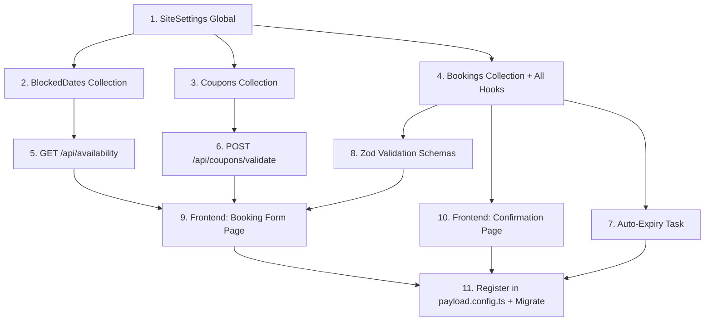

# Booking System — Detailed Implementation Plan

Based on [PRD](file:///Users/dhafin/trasmambang-platform/docs/prd_booking_system.md) and [architecture](file:///Users/dhafin/trasmambang-platform/docs/architecture.md). Inspired by patterns from [payload-reserve](https://github.com/elghaied/payload-reserve) (status machine, conflict detection, lifecycle hooks) but built entirely custom for our full-day homestay model.

## Resolved Decisions

| Question                | Answer                                                                  |
| ----------------------- | ----------------------------------------------------------------------- |
| Hard max guest capacity | **Standard: 8**, hard max: **12**                                       |
| Same-day booking        | **No** — require **1 day advance**                                      |
| Bank details            | **Placeholders** in SiteSettings + **copy button** on confirmation page |
| WhatsApp notifications  | **wa.me links only** (Phase 1)                                          |
| Overlap check           | **Transaction-safe** — `payload.find()` inside Payload's auto-transaction via `req` |
| Plugin                  | **Not using** payload-reserve — too slot-oriented, only ~15% overlap    |

> [!WARNING]
> **New dependencies:**
>
> - `react-day-picker` — availability calendar
> - `zod` — shared validation schemas
> - `@hookform/resolvers` — zod resolver for react-hook-form (already has react-hook-form)

---

## Race Condition & Anti-Spam Strategy

### Problem 1: Two people booking the same dates simultaneously

**How Payload protects us:** Payload CMS on PostgreSQL **automatically wraps each create/update operation (including all hooks) in a single database transaction**. When we pass `req` to nested operations inside hooks, they join the same transaction.

This means our `beforeChange` hook's overlap check + insert are **atomic** — if two requests arrive simultaneously:

```
Request A: beforeChange → find(no conflict) → INSERT booking → COMMIT ✅
Request B: beforeChange → find(no conflict) → INSERT booking → COMMIT ✅ ← PROBLEM?
```

The issue: both `find()` calls execute before either `INSERT`, so both see "no conflict".

**Solution: Database-level unique constraint + Payload transaction retry**

We add a **composite approach**:

1. **Application-level check** (the `beforeChange` hook) catches 99.9% of conflicts with a clear error message
2. **Database-level safety net** via a Payload `beforeChange` hook that passes `req` to all operations, keeping them in the same PostgreSQL transaction. If a conflict slips through at the DB level, the transaction fails and Payload returns a 500 error.
3. **Short auto-expiry (24h)** means even if a phantom booking somehow gets through, the damage is temporary.

> [!NOTE]
> For a single homestay with low traffic (realistically <5 bookings/day), the probability of two people submitting the exact same dates within the same millisecond is negligible. The application-level check is sufficient. The 24h auto-expiry provides a safety net.

### Problem 2: Spam/prank bookings blocking real guests

This is the bigger concern. Someone could:
- Submit 10 fake bookings for different dates → all go PENDING → block the entire month
- Use fake phone numbers, never pay
- Dates are blocked for 24h until auto-expiry

**Multi-layered anti-spam strategy:**

| Layer | What | How |
|-------|------|-----|
| 🛡 **Rate limiting** (Nginx) | Max 3 booking submissions per IP per hour | Nginx `limit_req_zone` on `POST /api/bookings` |
| 🛡 **Rate limiting** (App) | Max 3 PENDING bookings per phone number | `beforeChange` hook checks existing PENDING bookings by phone |
| 🛡 **Honeypot field** | Hidden form field bots fill in | If filled → silently reject |
| 🛡 **Short expiry** | PENDING bookings expire in 24h | Owner can also reduce to 6h or 12h in SiteSettings |
| 🛡 **Manual cancel** | Owner can cancel suspicious bookings instantly | Via admin panel → dates freed immediately |
| 🔮 **Future: CAPTCHA** | Phase 2 if spam becomes a real problem | Cloudflare Turnstile (free) |

**New hook — `preventSpam.ts`:**

```typescript
import type { CollectionBeforeChangeHook } from 'payload'
import { ValidationError } from 'payload'

const MAX_PENDING_PER_PHONE = 3

export const preventSpam: CollectionBeforeChangeHook = async ({
  data, operation, req,
}) => {
  if (operation !== 'create' || !data?.phone) return data

  // Check how many PENDING bookings this phone already has
  const { totalDocs } = await req.payload.find({
    collection: 'bookings',
    where: {
      and: [
        { phone: { equals: data.phone } },
        { bookingStatus: { equals: 'pending' } },
      ],
    },
    limit: 0,
    req, // same transaction
  })

  if (totalDocs >= MAX_PENDING_PER_PHONE) {
    throw new ValidationError({
      errors: [{
        message: 'Anda sudah memiliki booking yang belum dibayar. Silakan selesaikan pembayaran atau tunggu hingga kedaluwarsa.',
        path: 'phone',
      }],
    })
  }

  return data
}
```

**Honeypot field** (added to Bookings collection + booking form):

```typescript
// In Bookings.ts - hidden field
{
  name: 'website', // honeypot - bots fill this in
  type: 'text',
  admin: { hidden: true },
  hooks: {
    beforeChange: [({ value }) => {
      if (value) throw new ValidationError({
        errors: [{ message: 'Invalid submission', path: 'website' }],
      })
      return value
    }],
  },
}
```

### Updated hook order in Bookings collection:

```typescript
hooks: {
  beforeValidate: [generateBookingCode, calculatePricing],
  beforeChange: [preventSpam, checkDateOverlap, validateStatusTransition],
  afterChange: [manageCouponUsage, notifyOwner],
}
```

---

## Proposed Changes

### Component 1: SiteSettings Global

#### [NEW] [SiteSettings.ts](file:///Users/dhafin/trasmambang-platform/src/globals/SiteSettings.ts)

```typescript
import type { GlobalConfig } from "payload";

export const SiteSettings: GlobalConfig = {
  slug: "site-settings",
  label: "Site Settings",
  access: { read: () => true },
  fields: [
    // -- Pricing --
    {
      type: "collapsible",
      label: "Pricing",
      fields: [
        {
          name: "pricePerNight",
          type: "number",
          required: true,
          defaultValue: 0,
          admin: { description: "Harga per malam (Rupiah)" },
        },
      ],
    },
    // -- Capacity --
    {
      type: "collapsible",
      label: "Capacity",
      fields: [
        {
          name: "standardCapacity",
          type: "number",
          defaultValue: 8,
          admin: { description: "Batas tamu standar (fasilitas handuk)" },
        },
        {
          name: "maxCapacity",
          type: "number",
          defaultValue: 12,
          admin: { description: "Batas tamu maksimal (hard limit)" },
        },
      ],
    },
    // -- Booking Rules --
    {
      type: "collapsible",
      label: "Booking Rules",
      fields: [
        { name: "maxBookingNights", type: "number", defaultValue: 30 },
        {
          name: "bookingExpiryHours",
          type: "number",
          defaultValue: 24,
          admin: { description: "Booking pending auto-expire setelah X jam" },
        },
        {
          name: "minAdvanceDays",
          type: "number",
          defaultValue: 1,
          admin: {
            description: "Minimum hari advance booking (0 = sama hari)",
          },
        },
      ],
    },
    // -- Bank Transfer --
    {
      type: "collapsible",
      label: "Bank Transfer Details",
      fields: [
        {
          name: "bankName",
          type: "text",
          admin: { description: "e.g. BCA, BRI, Mandiri" },
        },
        { name: "bankAccountNumber", type: "text" },
        { name: "bankAccountName", type: "text" },
      ],
    },
    // -- WhatsApp --
    {
      type: "collapsible",
      label: "WhatsApp",
      fields: [
        {
          name: "whatsappNumber",
          type: "text",
          admin: { description: "Nomor WA owner (format: 6285xxx)" },
        },
      ],
    },
  ],
};
```

---

### Component 2: Bookings Collection

#### [NEW] [Bookings.ts](file:///Users/dhafin/trasmambang-platform/src/collections/Bookings.ts)

**Access control pattern** (inspired by payload-reserve):

- `create`: [anyone](file:///Users/dhafin/trasmambang-platform/src/access/anyone.ts#3-4) — guests submit from public form
- [read](file:///Users/dhafin/trasmambang-platform/src/PromoPopup/config.ts#9-10): custom — authenticated users see all; public can read by `bookingCode` only
- `update/delete`: [authenticated](file:///Users/dhafin/trasmambang-platform/src/access/authenticated.ts#7-10) only

**Status machine** (inspired by payload-reserve's transition map):

```typescript
// Booking status transitions (enforced in beforeChange hook)
const BOOKING_TRANSITIONS: Record<string, string[]> = {
  pending: ["confirmed", "cancelled", "expired"],
  confirmed: ["completed", "cancelled"],
  cancelled: [], // terminal
  expired: [], // terminal
  completed: [], // terminal
};

// Statuses that "block" dates (prevent new bookings)
const BLOCKING_STATUSES = ["pending", "confirmed"];
```

**Collection fields:**

```typescript
import type { CollectionConfig } from "payload";
import { anyone } from "../access/anyone";
import { authenticated } from "../access/authenticated";
import { generateBookingCode } from "../hooks/booking/generateBookingCode";
import { calculatePricing } from "../hooks/booking/calculatePricing";
import { checkDateOverlap } from "../hooks/booking/checkDateOverlap";
import { validateStatusTransition } from "../hooks/booking/validateStatusTransition";
import { manageCouponUsage } from "../hooks/booking/manageCouponUsage";
import { notifyOwner } from "../hooks/booking/notifyOwner";

export const Bookings: CollectionConfig = {
  slug: "bookings",
  admin: {
    useAsTitle: "bookingCode",
    defaultColumns: [
      "bookingCode",
      "guestName",
      "checkIn",
      "checkOut",
      "bookingStatus",
      "paymentStatus",
    ],
    listSearchableFields: ["bookingCode", "guestName", "phone"],
    group: "Booking System",
  },
  access: {
    create: anyone,
    read: ({ req }) => {
      if (req.user) return true;
      // Public: only allow reading by bookingCode (for status page)
      return { bookingCode: { exists: true } };
    },
    update: authenticated,
    delete: authenticated,
  },
  hooks: {
    beforeValidate: [generateBookingCode, calculatePricing],
    beforeChange: [checkDateOverlap, validateStatusTransition],
    afterChange: [manageCouponUsage, notifyOwner],
  },
  fields: [
    // -- Booking Identification --
    {
      name: "bookingCode",
      type: "text",
      unique: true,
      admin: { readOnly: true, position: "sidebar" },
    },
    // -- Guest Info --
    { name: "guestName", type: "text", required: true, maxLength: 100 },
    { name: "phone", type: "text", required: true },
    { name: "email", type: "email" },
    // -- Dates --
    {
      name: "checkIn",
      type: "date",
      required: true,
      admin: {
        date: { pickerAppearance: "dayOnly", displayFormat: "dd/MM/yyyy" },
      },
    },
    {
      name: "checkOut",
      type: "date",
      required: true,
      admin: {
        date: { pickerAppearance: "dayOnly", displayFormat: "dd/MM/yyyy" },
      },
    },
    // -- Guests --
    { name: "numGuests", type: "number", required: true, min: 1, max: 12 },
    // -- Status --
    {
      name: "bookingStatus",
      type: "select",
      defaultValue: "pending",
      options: [
        { label: "Pending", value: "pending" },
        { label: "Confirmed", value: "confirmed" },
        { label: "Cancelled", value: "cancelled" },
        { label: "Expired", value: "expired" },
        { label: "Completed", value: "completed" },
      ],
      admin: { position: "sidebar" },
    },
    {
      name: "paymentStatus",
      type: "select",
      defaultValue: "unpaid",
      options: [
        { label: "Unpaid", value: "unpaid" },
        { label: "Transfer Sent", value: "transfer_sent" },
        { label: "Confirmed", value: "confirmed" },
      ],
      admin: { position: "sidebar" },
    },
    // -- Pricing --
    { name: "totalPrice", type: "number", admin: { readOnly: true } },
    { name: "couponCode", type: "text" },
    {
      name: "discountAmount",
      type: "number",
      defaultValue: 0,
      admin: { readOnly: true },
    },
    { name: "finalPrice", type: "number", admin: { readOnly: true } },
    // -- Notes --
    {
      name: "notes",
      type: "textarea",
      admin: { description: "Permintaan khusus dari tamu" },
    },
    {
      name: "internalNotes",
      type: "textarea",
      access: { read: authenticated, update: authenticated },
      admin: { description: "Catatan internal (tidak terlihat oleh tamu)" },
    },
  ],
};
```

---

### Component 3: Coupons Collection

#### [NEW] [Coupons.ts](file:///Users/dhafin/trasmambang-platform/src/collections/Coupons.ts)

```typescript
import type { CollectionConfig } from "payload";
import { authenticated } from "../access/authenticated";

export const Coupons: CollectionConfig = {
  slug: "coupons",
  admin: {
    useAsTitle: "code",
    defaultColumns: [
      "code",
      "discountType",
      "discountValue",
      "usedCount",
      "isActive",
    ],
    group: "Booking System",
  },
  access: {
    create: authenticated,
    read: authenticated, // public validation via custom route
    update: authenticated,
    delete: ({ req, data }) => {
      if (!req.user) return false;
      // Only allow delete if never used
      return data?.usedCount === 0;
    },
  },
  fields: [
    {
      name: "code",
      type: "text",
      required: true,
      unique: true,
      hooks: { beforeValidate: [({ value }) => value?.toUpperCase().trim()] },
    },
    {
      name: "discountType",
      type: "select",
      required: true,
      options: [
        { label: "Percentage (%)", value: "percentage" },
        { label: "Fixed (Rp)", value: "fixed" },
      ],
    },
    { name: "discountValue", type: "number", required: true, min: 1 },
    {
      name: "maxDiscountAmount",
      type: "number",
      admin: {
        description: "Cap diskon untuk tipe percentage (Rp)",
        condition: (data) => data?.discountType === "percentage",
      },
    },
    {
      name: "minNights",
      type: "number",
      admin: { description: "Min malam untuk pakai kupon" },
    },
    {
      name: "maxUses",
      type: "number",
      admin: { description: "Batas pemakaian (kosong = unlimited)" },
    },
    {
      name: "usedCount",
      type: "number",
      defaultValue: 0,
      admin: { readOnly: true },
    },
    { name: "validFrom", type: "date" },
    { name: "validUntil", type: "date" },
    { name: "isActive", type: "checkbox", defaultValue: true },
  ],
};
```

---

### Component 4: BlockedDates Collection

#### [NEW] [BlockedDates.ts](file:///Users/dhafin/trasmambang-platform/src/collections/BlockedDates.ts)

```typescript
import type { CollectionConfig } from "payload";
import { anyone } from "../access/anyone";
import { authenticated } from "../access/authenticated";

export const BlockedDates: CollectionConfig = {
  slug: "blocked-dates",
  admin: {
    useAsTitle: "reason",
    defaultColumns: ["startDate", "endDate", "reason"],
    group: "Booking System",
  },
  access: {
    create: authenticated,
    read: anyone, // needed by availability API
    update: authenticated,
    delete: authenticated,
  },
  fields: [
    {
      name: "startDate",
      type: "date",
      required: true,
      admin: { date: { pickerAppearance: "dayOnly" } },
    },
    {
      name: "endDate",
      type: "date",
      required: true,
      admin: { date: { pickerAppearance: "dayOnly" } },
    },
    {
      name: "reason",
      type: "text",
      admin: { description: 'e.g. "Pemakaian pribadi", "Maintenance"' },
    },
  ],
};
```

---

### Component 5: Booking Hooks

All hooks in `src/hooks/booking/`. Inspired by payload-reserve's architecture: separate hook files, each focused on a single concern.

#### [NEW] [generateBookingCode.ts](file:///Users/dhafin/trasmambang-platform/src/hooks/booking/generateBookingCode.ts)

`beforeValidate` hook — auto-generates `TM-YYMM-NNN` on create:

```typescript
import type { CollectionBeforeValidateHook } from "payload";

export const generateBookingCode: CollectionBeforeValidateHook = async ({
  data,
  operation,
  req,
}) => {
  if (operation !== "create" || !data) return data;

  const now = new Date();
  const yy = String(now.getFullYear()).slice(-2);
  const mm = String(now.getMonth() + 1).padStart(2, "0");
  const prefix = `TM-${yy}${mm}`;

  // Count existing bookings this month to generate sequential number
  const { totalDocs } = await req.payload.find({
    collection: "bookings",
    where: { bookingCode: { like: `${prefix}%` } },
    limit: 0, // only need count
  });

  const seq = String(totalDocs + 1).padStart(3, "0");
  data.bookingCode = `${prefix}-${seq}`;

  return data;
};
```

#### [NEW] [calculatePricing.ts](file:///Users/dhafin/trasmambang-platform/src/hooks/booking/calculatePricing.ts)

`beforeValidate` hook — calculates totalPrice, discountAmount, finalPrice:

```typescript
import type { CollectionBeforeValidateHook } from "payload";

export const calculatePricing: CollectionBeforeValidateHook = async ({
  data,
  operation,
  req,
}) => {
  if (operation !== "create" || !data?.checkIn || !data?.checkOut) return data;

  // Get price from SiteSettings
  const settings = await req.payload.findGlobal({ slug: "site-settings" });
  const pricePerNight = settings.pricePerNight || 0;

  // Calculate nights
  const checkIn = new Date(data.checkIn);
  const checkOut = new Date(data.checkOut);
  const nights = Math.ceil(
    (checkOut.getTime() - checkIn.getTime()) / (1000 * 60 * 60 * 24),
  );

  if (nights < 1) throw new Error("Check-out harus setelah check-in");

  data.totalPrice = nights * pricePerNight;

  // Apply coupon discount if present
  if (data.couponCode) {
    const { docs: coupons } = await req.payload.find({
      collection: "coupons",
      where: { code: { equals: data.couponCode.toUpperCase().trim() } },
      limit: 1,
    });

    const coupon = coupons[0];
    if (coupon) {
      let discount = 0;
      if (coupon.discountType === "percentage") {
        discount = data.totalPrice * (coupon.discountValue / 100);
        if (coupon.maxDiscountAmount && discount > coupon.maxDiscountAmount) {
          discount = coupon.maxDiscountAmount;
        }
      } else {
        discount = coupon.discountValue;
      }
      data.discountAmount = Math.min(discount, data.totalPrice); // can't go negative
    }
  } else {
    data.discountAmount = 0;
  }

  data.finalPrice = data.totalPrice - (data.discountAmount || 0);
  return data;
};
```

#### [NEW] [checkDateOverlap.ts](file:///Users/dhafin/trasmambang-platform/src/hooks/booking/checkDateOverlap.ts)

`beforeChange` hook (create only) — prevents double bookings. **All operations pass `req` for transaction atomicity** (per Payload ADAPTERS reference):

```typescript
import type { CollectionBeforeChangeHook } from 'payload'
import { ValidationError } from 'payload'

const BLOCKING_STATUSES = ['pending', 'confirmed']

export const checkDateOverlap: CollectionBeforeChangeHook = async ({
  data, operation, req,
}) => {
  if (operation !== 'create') return data
  if (!data?.checkIn || !data?.checkOut) return data

  // 1. Check against existing bookings (req = same transaction)
  const { docs: conflicting } = await req.payload.find({
    collection: 'bookings',
    where: {
      and: [
        { bookingStatus: { in: BLOCKING_STATUSES } },
        { checkIn: { less_than: data.checkOut } },
        { checkOut: { greater_than: data.checkIn } },
      ],
    },
    limit: 1,
    req, // CRITICAL: same transaction for atomicity
  })

  if (conflicting.length > 0) {
    throw new ValidationError({
      errors: [{ message: 'Tanggal sudah dipesan, silakan pilih tanggal lain', path: 'checkIn' }],
    })
  }

  // 2. Check against blocked dates
  const { docs: blocked } = await req.payload.find({
    collection: 'blocked-dates',
    where: {
      and: [
        { startDate: { less_than: data.checkOut } },
        { endDate: { greater_than: data.checkIn } },
      ],
    },
    limit: 1,
    req, // same transaction
  })

  if (blocked.length > 0) {
    throw new ValidationError({
      errors: [{ message: 'Tanggal tidak tersedia, silakan pilih tanggal lain', path: 'checkIn' }],
    })
  }

  // 3. Increment coupon usedCount (req = same transaction, rolls back on failure)
  if (data.couponCode) {
    const { docs: coupons } = await req.payload.find({
      collection: 'coupons',
      where: { code: { equals: data.couponCode.toUpperCase().trim() } },
      limit: 1,
      req,
    })
    if (coupons[0]) {
      await req.payload.update({
        collection: 'coupons',
        id: coupons[0].id,
        data: { usedCount: (coupons[0].usedCount || 0) + 1 },
        req, // same transaction — rolls back if booking creation fails
      })
    }
  }

  return data
}
```

#### [NEW] [validateStatusTransition.ts](file:///Users/dhafin/trasmambang-platform/src/hooks/booking/validateStatusTransition.ts)

`beforeChange` hook (update only) — enforces valid status transitions. Pattern from payload-reserve:

```typescript
import type { CollectionBeforeChangeHook } from "payload";
import { ValidationError } from "payload";

// Inspired by payload-reserve status machine
const TRANSITIONS: Record<string, string[]> = {
  pending: ["confirmed", "cancelled", "expired"],
  confirmed: ["completed", "cancelled"],
  cancelled: [],
  expired: [],
  completed: [],
};

export const validateStatusTransition: CollectionBeforeChangeHook = async ({
  data,
  operation,
  originalDoc,
  context,
}) => {
  if (operation !== "update" || !data?.bookingStatus || !originalDoc)
    return data;

  // Escape hatch for cron/admin operations (inspired by payload-reserve)
  if (context?.skipBookingHooks) return data;

  const from = originalDoc.bookingStatus;
  const to = data.bookingStatus;

  if (from === to) return data; // no change

  const allowed = TRANSITIONS[from] || [];
  if (!allowed.includes(to)) {
    throw new ValidationError({
      errors: [
        {
          message: `Tidak bisa mengubah status dari "${from}" ke "${to}"`,
          path: "bookingStatus",
        },
      ],
    });
  }

  return data;
};
```

#### [NEW] [manageCouponUsage.ts](file:///Users/dhafin/trasmambang-platform/src/hooks/booking/manageCouponUsage.ts)

`afterChange` hook (update only) — decrements coupon usage on cancel/expire:

```typescript
import type { CollectionAfterChangeHook } from 'payload'

export const manageCouponUsage: CollectionAfterChangeHook = async ({
  doc, previousDoc, operation, req,
}) => {
  if (operation !== 'update' || !previousDoc) return doc

  const statusChanged = doc.bookingStatus !== previousDoc.bookingStatus
  const isCancelled = ['cancelled', 'expired'].includes(doc.bookingStatus)

  if (statusChanged && isCancelled && doc.couponCode) {
    const { docs: coupons } = await req.payload.find({
      collection: 'coupons',
      where: { code: { equals: doc.couponCode } },
      limit: 1,
      req, // same transaction
    })
    if (coupons[0] && coupons[0].usedCount > 0) {
      await req.payload.update({
        collection: 'coupons',
        id: coupons[0].id,
        data: { usedCount: coupons[0].usedCount - 1 },
        req, // same transaction — atomic with status change
      })
    }
  }

  return doc
}
```

#### [NEW] [notifyOwner.ts](file:///Users/dhafin/trasmambang-platform/src/hooks/booking/notifyOwner.ts)

`afterChange` hook (create only) — generates wa.me link:

```typescript
import type { CollectionAfterChangeHook } from "payload";

export const notifyOwner: CollectionAfterChangeHook = async ({
  doc,
  operation,
  req,
}) => {
  if (operation !== "create") return doc;

  const settings = await req.payload.findGlobal({ slug: "site-settings" });
  const ownerPhone = settings.whatsappNumber || "";

  if (!ownerPhone) {
    console.warn("[Booking] No WhatsApp number configured in SiteSettings");
    return doc;
  }

  const message = encodeURIComponent(
    `🏠 Booking Baru - Trasmambang\n\n` +
      `Kode: ${doc.bookingCode}\n` +
      `Nama: ${doc.guestName}\n` +
      `Check-in: ${doc.checkIn}\n` +
      `Check-out: ${doc.checkOut}\n` +
      `Tamu: ${doc.numGuests} orang\n` +
      `Total: Rp${doc.finalPrice?.toLocaleString("id-ID")}\n` +
      (doc.couponCode
        ? `Kupon: ${doc.couponCode} (-Rp${doc.discountAmount?.toLocaleString("id-ID")})\n`
        : "") +
      `\nCek detail: /admin/collections/bookings/${doc.id}`,
  );

  const waLink = `https://wa.me/${ownerPhone}?text=${message}`;
  console.log(
    `[Booking] New booking ${doc.bookingCode} — notify owner: ${waLink}`,
  );

  return doc;
};
```

---

### Component 6: Shared Validation Schemas

#### [NEW] [validations.ts](file:///Users/dhafin/trasmambang-platform/src/lib/validations.ts)

Zod schemas shared between frontend and backend:

```typescript
import { z } from "zod";

const phoneRegex = /^(\+62|62|08)\d{8,13}$/;

export const bookingFormSchema = z.object({
  guestName: z.string().min(2, "Nama minimal 2 karakter").max(100),
  phone: z
    .string()
    .regex(phoneRegex, "Format nomor HP tidak valid (contoh: 08xx atau +62xx)"),
  email: z
    .string()
    .email("Format email tidak valid")
    .optional()
    .or(z.literal("")),
  checkIn: z.string().min(1, "Pilih tanggal check-in"),
  checkOut: z.string().min(1, "Pilih tanggal check-out"),
  numGuests: z.number().min(1, "Minimal 1 tamu").max(12, "Maksimal 12 tamu"),
  couponCode: z.string().optional(),
  notes: z.string().max(500).optional(),
});

export type BookingFormData = z.infer<typeof bookingFormSchema>;

export const couponValidateSchema = z.object({
  code: z.string().min(1, "Masukkan kode kupon"),
  nights: z.number().min(1),
});
```

---

### Component 7: Custom API Routes

#### [NEW] [route.ts](<file:///Users/dhafin/trasmambang-platform/src/app/(frontend)/api/availability/route.ts>)

Returns all unavailable date ranges:

```typescript
import { getPayload } from "payload";
import config from "@payload-config";
import { NextResponse } from "next/server";

export async function GET() {
  const payload = await getPayload({ config });

  // Get all active bookings' date ranges
  const { docs: bookings } = await payload.find({
    collection: "bookings",
    where: { bookingStatus: { in: ["pending", "confirmed"] } },
    limit: 100,
    select: { checkIn: true, checkOut: true },
  });

  // Get all blocked dates
  const { docs: blocked } = await payload.find({
    collection: "blocked-dates",
    limit: 100,
    select: { startDate: true, endDate: true },
  });

  const unavailableDates = [
    ...bookings.map((b) => ({
      start: b.checkIn,
      end: b.checkOut,
      type: "booked" as const,
    })),
    ...blocked.map((b) => ({
      start: b.startDate,
      end: b.endDate,
      type: "blocked" as const,
    })),
  ];

  return NextResponse.json({ unavailableDates });
}
```

#### [NEW] [route.ts](<file:///Users/dhafin/trasmambang-platform/src/app/(frontend)/api/coupons/validate/route.ts>)

Validates coupon without creating anything:

```typescript
import { getPayload } from "payload";
import config from "@payload-config";
import { NextResponse } from "next/server";

export async function POST(request: Request) {
  const payload = await getPayload({ config });
  const { code, nights } = await request.json();

  if (!code)
    return NextResponse.json(
      { error: "Kode kupon diperlukan" },
      { status: 400 },
    );

  const { docs } = await payload.find({
    collection: "coupons",
    where: { code: { equals: code.toUpperCase().trim() } },
    limit: 1,
  });

  const coupon = docs[0];
  const genericError = "Kode kupon tidak valid atau sudah tidak berlaku";

  // Validation rules from PRD §10b
  if (!coupon || !coupon.isActive)
    return NextResponse.json({ error: genericError }, { status: 400 });

  const now = new Date();
  if (coupon.validUntil && new Date(coupon.validUntil) < now)
    return NextResponse.json({ error: genericError }, { status: 400 });
  if (coupon.validFrom && new Date(coupon.validFrom) > now)
    return NextResponse.json({ error: genericError }, { status: 400 });
  if (coupon.maxUses && coupon.usedCount >= coupon.maxUses)
    return NextResponse.json({ error: genericError }, { status: 400 });
  if (coupon.minNights && nights < coupon.minNights)
    return NextResponse.json(
      {
        error: `Kode kupon hanya berlaku untuk minimal ${coupon.minNights} malam`,
      },
      { status: 400 },
    );

  return NextResponse.json({
    valid: true,
    discountType: coupon.discountType,
    discountValue: coupon.discountValue,
    maxDiscountAmount: coupon.maxDiscountAmount || null,
  });
}
```

---

### Component 8: Auto-Expiry Task

#### [NEW] [expireBookings.ts](file:///Users/dhafin/trasmambang-platform/src/tasks/expireBookings.ts)

Uses Payload's built-in Jobs system:

```typescript
import type { TaskConfig } from "payload";

export const expireBookingsTask: TaskConfig<"expireBookings"> = {
  slug: "expireBookings",
  handler: async ({ req }) => {
    const settings = await req.payload.findGlobal({ slug: "site-settings" });
    const expiryHours = settings.bookingExpiryHours || 24;
    const cutoff = new Date(
      Date.now() - expiryHours * 60 * 60 * 1000,
    ).toISOString();

    const { docs: expired } = await req.payload.find({
      collection: "bookings",
      where: {
        and: [
          { bookingStatus: { equals: "pending" } },
          { paymentStatus: { equals: "unpaid" } },
          { createdAt: { less_than: cutoff } },
        ],
      },
      limit: 100,
    });

    for (const booking of expired) {
      await req.payload.update({
        collection: "bookings",
        id: booking.id,
        data: { bookingStatus: "expired" },
        // afterChange hook handles coupon usedCount decrement
      });
    }

    return { output: { expired: expired.length } };
  },
};
```

> [!NOTE]
> If Payload Jobs doesn't support cron-like scheduling easily, we'll create a `GET /api/cron/expire-bookings` route handler protected by `CRON_SECRET` and trigger it externally (e.g., via cron job on VPS: `curl -H "Authorization: Bearer $SECRET" https://trasmambang.com/api/cron/expire-bookings`).

---

### Component 9: Frontend — Booking Form Page

#### [NEW] [page.tsx](<file:///Users/dhafin/trasmambang-platform/src/app/(frontend)/booking/page.tsx>)

Server component:

- Fetches site settings (pricePerNight, capacity, minAdvanceDays) via `payload.findGlobal()`
- Fetches unavailable dates via internal call
- Passes data as props to client `<BookingForm />`

#### [NEW] [index.tsx](file:///Users/dhafin/trasmambang-platform/src/components/BookingForm/index.tsx)

Client component — main booking form using `react-hook-form` + Zod:

- **Step 1:** Date selection via `<AvailabilityCalendar />`
- **Step 2:** Guest details (name, phone, email, numGuests)
- **Step 3:** Order summary with optional `<CouponInput />`
- **Submit:** `POST /api/bookings` → redirect to `/booking/[bookingCode]`
- Shows warning when `numGuests > 8`: "Melebihi 8 tamu, lebih dari 8 tamu tidak mendapat fasilitas handuk"

#### [NEW] [availability-calendar.tsx](file:///Users/dhafin/trasmambang-platform/src/components/BookingForm/availability-calendar.tsx)

Client component using `react-day-picker`:

- Range selection mode for check-in/check-out
- Disabled dates: all dates from `unavailableDates` prop + past dates + dates within `minAdvanceDays`
- Visual states: greyed out (unavailable), green (selected), muted (past)

#### [NEW] [coupon-input.tsx](file:///Users/dhafin/trasmambang-platform/src/components/BookingForm/coupon-input.tsx)

Client component:

- Input + "Pakai" button
- Calls `POST /api/coupons/validate` with code + nights
- Success: shows green badge with discount preview
- Error: shows inline error message in red

#### [NEW] [order-summary.tsx](file:///Users/dhafin/trasmambang-platform/src/components/BookingForm/order-summary.tsx)

Client component:

- Dates + duration display
- `Rp[price] × [nights] malam = Rp[total]`
- Discount line if coupon: `Diskon ([code]): -Rp[amount]`
- Bold total: `Total: Rp[finalPrice]`

---

### Component 10: Frontend — Confirmation Page

#### [NEW] [page.tsx](<file:///Users/dhafin/trasmambang-platform/src/app/(frontend)/booking/[bookingCode]/page.tsx>)

Server component:

- Fetches booking by `bookingCode` via `payload.find({ where: { bookingCode } })`
- If not found → `notFound()`
- Fetches bank details from SiteSettings
- Renders:
  - **Booking code** prominently (large, copyable)
  - **Status badge** (color-coded: yellow=pending, green=confirmed, red=expired/cancelled, blue=completed)
  - **Bank transfer card**: bank name, account number with **copy button**, account name, amount to transfer
  - **Payment deadline**: `Bayar sebelum [createdAt + expiryHours]`
  - **WhatsApp button**: pre-filled with `Halo, saya sudah transfer untuk booking [bookingCode]`
  - **Booking details summary**: guest name, dates, nights, guests, price breakdown

---

### Component 11: Config Registration

#### [MODIFY] [payload.config.ts](file:///Users/dhafin/trasmambang-platform/src/payload.config.ts)

```diff
 import { Categories } from './collections/Categories'
+import { Bookings } from './collections/Bookings'
+import { Coupons } from './collections/Coupons'
+import { BlockedDates } from './collections/BlockedDates'
+import { SiteSettings } from './globals/SiteSettings'
+import { expireBookingsTask } from './tasks/expireBookings'

-  collections: [Pages, Posts, Media, Categories, Users],
+  collections: [Pages, Posts, Media, Categories, Users, Bookings, Coupons, BlockedDates],
-  globals: [Header, Footer, PromoPopup, LinkTree],
+  globals: [Header, Footer, PromoPopup, LinkTree, SiteSettings],
   ...
-    tasks: [],
+    tasks: [expireBookingsTask],
```

---

## Implementation Order

Recommended build order to enable incremental testing:



| Step | What                            | Est. Time | Can Test After?                                                     |
| ---- | ------------------------------- | --------- | ------------------------------------------------------------------- |
| 1    | SiteSettings global             | 15 min    | Yes — check `/admin`                                                |
| 2    | BlockedDates collection         | 10 min    | Yes — add entries in `/admin`                                       |
| 3    | Coupons collection              | 20 min    | Yes — CRUD in `/admin`                                              |
| 4    | Bookings + all 6 hooks          | 2 hours   | Yes — create booking via `/admin`, check code gen, pricing, overlap |
| 5    | `/api/availability` route       | 20 min    | Yes — `curl` the endpoint                                           |
| 6    | `/api/coupons/validate` route   | 20 min    | Yes — `curl` the endpoint                                           |
| 7    | Auto-expiry task                | 30 min    | Yes — create expired booking, trigger task                          |
| 8    | Zod schemas                     | 15 min    | Yes — unit tests                                                    |
| 9    | Booking form page               | 2-3 hours | Yes — full form in browser                                          |
| 10   | Confirmation page               | 1-2 hours | Yes — visit `/booking/[code]`                                       |
| 11   | Config registration + migration | 15 min    | Yes — `pnpm dev`                                                    |

**Total estimated: ~7-9 hours**

---

## File Summary

| #   | Type       | File                                                   | Purpose                                  |
| --- | ---------- | ------------------------------------------------------ | ---------------------------------------- |
| 1   | Global     | `src/globals/SiteSettings.ts`                          | Pricing, capacity, bank, WhatsApp config |
| 2   | Collection | `src/collections/Bookings.ts`                          | Booking records + all hooks wiring       |
| 3   | Collection | `src/collections/Coupons.ts`                           | Coupon codes                             |
| 4   | Collection | `src/collections/BlockedDates.ts`                      | Owner-blocked dates                      |
| 5   | Hook       | `src/hooks/booking/generateBookingCode.ts`             | TM-YYMM-NNN generation                   |
| 6   | Hook       | `src/hooks/booking/calculatePricing.ts`                | Price calc + coupon discount             |
| 7   | Hook       | `src/hooks/booking/checkDateOverlap.ts`                | Conflict detection + coupon increment    |
| 8   | Hook       | `src/hooks/booking/validateStatusTransition.ts`        | Status machine enforcement               |
| 9   | Hook       | `src/hooks/booking/manageCouponUsage.ts`               | Coupon decrement on cancel/expire        |
| 10  | Hook       | `src/hooks/booking/notifyOwner.ts`                     | wa.me link for owner                     |
| 11  | Validation | `src/lib/validations.ts`                               | Shared Zod schemas                       |
| 12  | API Route  | `src/app/(frontend)/api/availability/route.ts`         | Unavailable dates                        |
| 13  | API Route  | `src/app/(frontend)/api/coupons/validate/route.ts`     | Coupon validation                        |
| 14  | Task       | `src/tasks/expireBookings.ts`                          | Auto-expire unpaid bookings              |
| 15  | Page       | `src/app/(frontend)/booking/page.tsx`                  | Booking form page                        |
| 16  | Page       | `src/app/(frontend)/booking/[bookingCode]/page.tsx`    | Confirmation/status page                 |
| 17  | Component  | `src/components/BookingForm/index.tsx`                 | Main form                                |
| 18  | Component  | `src/components/BookingForm/availability-calendar.tsx` | Date picker                              |
| 19  | Component  | `src/components/BookingForm/coupon-input.tsx`          | Coupon input                             |
| 20  | Component  | `src/components/BookingForm/order-summary.tsx`         | Price breakdown                          |
| 21  | Config     | [src/payload.config.ts](file:///Users/dhafin/trasmambang-platform/src/payload.config.ts)                                | Register collections + global            |

---

## Verification Plan

### After Backend (Steps 1-7)

```bash
# 1. Start dev server — migrations run automatically
pnpm dev

# 2. Verify in /admin:
#    - SiteSettings appears in sidebar → fill in test price (e.g. 500000)
#    - Bookings, Coupons, BlockedDates appear under "Booking System" group
#    - Create a test coupon: code=TEST10, type=percentage, value=10

# 3. Test booking via admin panel:
#    - Create booking → verify bookingCode auto-generated (TM-2603-001)
#    - Verify totalPrice/finalPrice calculated
#    - Try creating overlapping booking → should get error

# 4. Test API routes:
curl http://localhost:3000/api/availability
curl -X POST http://localhost:3000/api/coupons/validate \
  -H "Content-Type: application/json" \
  -d '{"code":"TEST10","nights":2}'

# 5. Test status transitions:
#    - In admin: change booking pending → confirmed ✅
#    - Try confirmed → pending ❌ (should be blocked)
#    - Change to cancelled → verify coupon usedCount decremented
```

### After Frontend (Steps 8-10)

1. Open `/booking` in browser → verify calendar loads with blocked dates
2. Select dates → verify price updates in order summary
3. Enter coupon → verify discount appears or error shows
4. Fill form → submit → verify redirect to `/booking/[code]`
5. Verify confirmation page: booking details, bank transfer card with copy button, WhatsApp link
6. Test mobile responsiveness (375px)

### Edge Cases to Manually Verify

| Scenario                    | Expected                                    |
| --------------------------- | ------------------------------------------- |
| Two overlapping bookings    | Second gets "Tanggal sudah dipesan" error   |
| Guest > 8, ≤ 12             | Warning shown, can still submit             |
| Guest > 12                  | Form validation blocks submit               |
| Invalid coupon code         | "Kode kupon tidak valid" error              |
| Expired coupon              | Same generic error (don't reveal it exists) |
| Random `/booking/[code]`    | 404 page                                    |
| Status: confirmed → pending | Blocked by status transition                |
| Cancel booking with coupon  | `usedCount` decremented                     |
